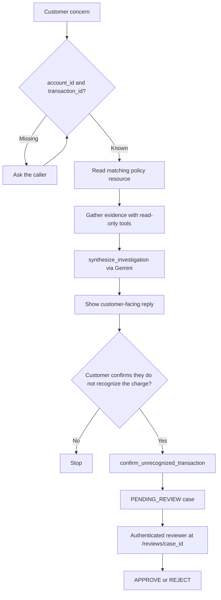

# Financial Transaction Resolution MCP Server

An enterprise-oriented MCP server that investigates synthetic card
transactions using deterministic evidence tools, Gemini synthesis, and a
server-enforced human-review workflow.


> **Disclaimer.** All customers, accounts, transactions, policies and decision rules in this
> repository are fictional and synthetically generated. No employer, card-network or customer data
> was used. This project is not affiliated with or representative of any financial institution.

▶️ [Watch the demo](demo/financial-transaction-resolution-demo.mp4)

- [Overview](#overview)
- [Demo](#demo)
- [Key Capabilities](#key-capabilities)
- [Architecture](#architecture)
- [Workflow](#investigation-and-dispute-workflow)
- [Security and Trust Boundaries](#security-and-trust-boundaries)
- [Evaluation and Observability](#evaluation-and-observability)
- [Quick Start](#quick-start)
- [Connect an MCP Client](#connect-an-mcp-client)
- [Quality Checks](#quality-checks)
- [Production Considerations](#production-considerations)
- [Documentation](#documentation)
- [License](#license)

## Overview

Cardholders often cannot tell a legitimate posting from a duplicate or an unreadable statement
descriptor. Support agents then have to reconstruct facts before they can explain a charge or open
a case. This server models that investigation as an MCP workflow: account-scoped tools establish
the facts, a policy resource constrains the reply, and a human reviewer decides the case. Every
customer, account, merchant and policy in the dataset is synthetic. Registering a case writes a
SQLite row; it does not file or resolve a dispute with a card network.

Deterministic services establish financial facts. Gemini converts verified evidence into
customer-facing language. Server-side authorization controls case creation and review.

## Demo

▶️ [Watch the demo](demo/financial-transaction-resolution-demo.mp4)

Example request:

> Customer does not recognize transaction `TXN-SCN-DUP-A` on `ACCT-0001`.

The server gathers account-scoped evidence, identifies a likely duplicate, generates a grounded
explanation, and creates a reviewable dispute case only after explicit customer confirmation.
That seeded scenario is a same-day double post at Halcyon Electronics
(`TXN-SCN-DUP-A` / `TXN-SCN-DUP-B`).

A tool-by-tool walkthrough of this scenario and others is in the
[demo guide](docs/demo-guide.md).

## Key Capabilities

- FastMCP tools, prompts and resources for investigation, policy lookup and case confirmation
- Deterministic duplicate detection, including holds and recurring charges that should not be
  treated as fraud
- Account-scoped data access so a charge on another account is indistinguishable from a missing id
- Gemini structured synthesis of verified evidence into a customer-facing reply
- Prompt-injection defenses on identifiers, findings and model output
- PII masking and sanitized audit records
- Descope JWT authentication for HTTP transport
- Human-review dispute workflow with server-issued confirmation tokens
- Opik observability for tool calls, LLM latency and token usage (online binary evaluation planned)
- Automated tests and typed Pydantic contracts

## Architecture

The server is a local FastMCP process. Cursor can launch it over **stdio**. Network listeners use
**HTTP** with [Descope](https://www.descope.com/) bearer JWTs. Stdio logs go to stderr so stdout
stays the protocol wire.

Layers are strictly separated. Dependencies point inward: the MCP layer knows about handlers,
handlers know about services and repositories, and the domain knows about nothing else.

```
        MCP client (Cursor, Claude Desktop, Inspector)
                          │  stdio  or  HTTP + Descope JWT
┌─────────────────────────▼──────────────────────────────────┐
│ src/server.py            FastMCP app, instructions, auth    │
├────────────────────────────────────────────────────────────┤
│ src/routers/             Registration only. Translates MCP  │
│   tools.py               arguments into request contracts.  │
│   prompts.py             No logic, no SQL.                  │
│   resources.py                                              │
├────────────────────────────────────────────────────────────┤
│ src/tools/               Thin handlers: validate, call a    │
│   *_tool.py              service, present the result.       │
├────────────────────────────────────────────────────────────┤
│ src/app/                 execution.py  audit + error + time │
│                          container.py  composition root     │
│                          validators.py identifier checks    │
│                          presenters.py domain → contract    │
│                          data_seed.py  synthetic generator  │
├────────────────────────────────────────────────────────────┤
│ src/contracts/           Pydantic request and response      │
│                          models; the shared envelope.       │
├────────────────────────────────────────────────────────────┤
│ src/domain/              models.py    frozen dataclasses    │
│                          criteria.py  validated queries     │
│                          services/    merchant resolution,  │
│                                       duplicate detection   │
│                          exceptions.py stable error codes   │
├────────────────────────────────────────────────────────────┤
│ src/repositories/        SQLAlchemy 2.x. Every transaction  │
│                          query is account-scoped.           │
├────────────────────────────────────────────────────────────┤
│ src/security/masking.py  │  src/audit/service.py            │
│ src/llm/gemini_client.py │  src/observability/tracing.py    │
│ src/workflows/           LangGraph HITL dispute review      │
│ SQLite data/transactions.db  │  Opik (optional agent traces)    │
└────────────────────────────────────────────────────────────┘
```

A typical tool call travels from `src/routers/tools.py` into a handler, then through `execute_tool`
in `src/app/execution.py`. That wrapper is the only path that constructs a response: it assigns a
correlation id, times the work, translates domain errors into a stable `{status, request_id, data,
error}` envelope, writes a sanitized audit event, and (when Opik is configured) records a tool span.
`Container` (`src/app/container.py`) is the composition root, so tests can inject an in-memory
SQLite database and exercise the whole stack without a live client. Amounts are stored as integer
minor units and exposed as `Decimal` strings so duplicate checks are exact.

Four principles govern the design:

1. **Deterministic evidence, probabilistic presentation.** Merchant resolution and duplicate
   detection are rule-based and repeatable. Gemini is used only to draft the customer-facing
   narrative from already-verified envelopes.
2. **LLM outside the authorization boundary.** Gemini cannot approve, submit, refund or change
   workflow state. Opening a case requires a server-issued `confirmation_token`.
3. **Account isolation by repository design.** Every transaction query includes `account_id` in its
   `WHERE` clause. There is no fetch-by-id-then-check-ownership path.
4. **Human-controlled workflow transitions.** Customer confirmation writes a `PENDING_REVIEW` case.
   An authenticated reviewer records `APPROVE` or `REJECT`. The model never makes that decision.

Directory-by-directory notes, request lifecycle and error taxonomy are in
[`docs/architecture.md`](docs/architecture.md).

## Investigation and Dispute Workflow



The host starts from the `investigate_transaction` prompt. If identifiers are missing, the prompt
tells the agent to stop and ask. The agent then reads one policy resource, calls the evidence tools,
and finishes with `synthesize_investigation`. Evidence analysis never calls a model. Eligible
replies include a one-time `confirmation_token`. After the customer explicitly confirms they do not
recognize the charge, `confirm_unrecognized_transaction` writes a `PENDING_REVIEW` case and an
immutable evidence snapshot, then LangGraph pauses for authenticated review at `/reviews/{case_id}`.
Reviewer identity comes from a verified JWT (`sub` plus `dispute:review`); `reviewer_id` is not
accepted in the JSON body.

Prompt text, policy routing and hard constraints are in
[`docs/investigation-workflow.md`](docs/investigation-workflow.md).

## Security and Trust Boundaries

- Every transaction lookup is scoped to an account.
- Customer names and full account/card details are not returned.
- Audit and observability payloads are sanitized.
- Findings are treated as untrusted input when sent to Gemini.
- Gemini cannot approve, submit, refund, or change workflow state.
- Network transport requires JWT authentication.
- Human decisions are authenticated, expiring and replay-protected.

Threat scenarios, prompt-injection controls and Descope review-route identity are in
[`docs/security.md`](docs/security.md).

## Evaluation and Observability

The project combines:

- Deterministic checks for factual accuracy and prohibited claims
- Opt-in live Gemini evaluations
- Opik tracing for tool calls, LLM latency and token usage
- Planned: Opik online binary evaluation for grounded customer responses

```bash
uv run pytest -m "not live_eval"
uv run pytest -m live_eval -s
```

Live evals need `GEMINI_API_KEY` and are excluded from the default suite. Rubric definitions,
dataset schema and scorer details are in [`evals/README.md`](evals/README.md). Opik setup is in
[`docs/observability.md`](docs/observability.md).

## Quick Start

### Requirements

- Python 3.14
- [`uv`](https://github.com/astral-sh/uv)
- Gemini API key only for live synthesis

### Setup

```bash
git clone https://github.com/abinashray008/financial-transaction-resolution-mcp.git
cd financial-transaction-resolution-mcp
cp .env.example .env
uv sync --frozen
uv run python scripts/generate_data.py --seed 42
uv run python -m src.server
```

Evidence tools run with no API keys. Set `GEMINI_API_KEY` in `.env` only if you want
`synthesize_investigation`. Opik and Descope keys are optional and needed only for traces or
HTTP transport. The process waits on stdio until an MCP client connects.

Full environment-variable documentation is in [`docs/configuration.md`](docs/configuration.md).

## Connect an MCP Client

Add this block to the project-level `.cursor/mcp.json` (already present in this repo):

```json
{
  "mcpServers": {
    "financial-transaction-resolution": {
      "command": "uv",
      "args": [
        "run",
        "python",
        "-m",
        "src.server"
      ],
      "cwd": "${workspaceFolder}",
      "env": {
        "ENV_FILE_PATH": "${workspaceFolder}/.env"
      }
    }
  }
}
```

Generate `data/transactions.db` before connecting, then restart the MCP server in Cursor after
changing `.env`. Claude Desktop, Inspector, HTTP and Descope configurations are in
[`docs/client-setup.md`](docs/client-setup.md).

## Quality Checks

```bash
uv run ruff check .
uv run ruff format --check .
uv run mypy
uv run pytest -m "not live_eval"
```

Install git hooks with `uv run pre-commit install` so lint and format run on commit. The default
pytest run covers masking, search filters, cross-account isolation, analysis rules, audit
sanitization, seed reproducibility, protocol discovery and synthesis with an injected Gemini client.

## Production Considerations

This repository is a local reference implementation. A production deployment would replace SQLite
with PostgreSQL, use a durable distributed workflow backend, manage secrets externally, add bounded
retries and circuit breakers, and integrate with an authorized dispute-processing system.

See [`docs/production-readiness.md`](docs/production-readiness.md).

## Documentation

| Topic | Document |
| --- | --- |
| Layered design and project structure | [`docs/architecture.md`](docs/architecture.md) |
| Investigation prompt and phases | [`docs/investigation-workflow.md`](docs/investigation-workflow.md) |
| Tool catalog | [`docs/tools.md`](docs/tools.md) |
| Synthetic dataset and scenarios | [`docs/dataset.md`](docs/dataset.md) |
| Database tables | [`docs/data-model.md`](docs/data-model.md) |
| Trust boundaries and threat scenarios | [`docs/security.md`](docs/security.md) |
| Environment variables | [`docs/configuration.md`](docs/configuration.md) |
| MCP clients, HTTP and Descope | [`docs/client-setup.md`](docs/client-setup.md) |
| Opik tracing | [`docs/observability.md`](docs/observability.md) |
| Eval rubric and scorers | [`evals/README.md`](evals/README.md) |
| Example queries | [`docs/demo-guide.md`](docs/demo-guide.md) |
| Troubleshooting | [`docs/troubleshooting.md`](docs/troubleshooting.md) |
| Production gaps | [`docs/production-readiness.md`](docs/production-readiness.md) |

## License

This project is licensed under the MIT License — see the [LICENSE](LICENSE) file for details.
